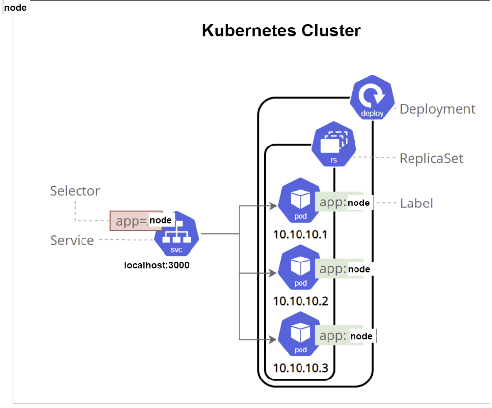

# Kubernetes

## What is Kubernetes?

Kubernetes is an open-source system for automating deployment, scaling, and management of containerized applications. It groups containers that make up an application into logical units for easy management and discovery. Kubernetes builds upon 15 years of experience of running production workloads at Google, combined with best-of-breed ideas and practices from the community.

## Benefits of Kubernetes

* **Service discovery and load balancing** - Kubernetes can expose a container using the DNS name or using their own IP address. If traffic to a container is high, Kubernetes is able to load balance and distribute the network traffic so that the deployment is stable.

* **Storage orchestration** - Kubernetes allows you to automatically mount a storage system of your choice, such as local storages, public cloud providers, and more.

* **Automated rollouts and rollbacks** - Kubernetes allows you to deploy new containers using rolling updates. Kubernetes also allows you to rollback to an earlier deployment, if necessary.

* **Self-healing** - Kubernetes restarts containers that fail, replaces and reschedules containers when nodes die, kills containers that don’t respond to your user-defined health check, and doesn’t advertise them to clients until they are ready to serve.

## Use Cases and Who Uses Kubernetes

Kubernetes is a portable, extensible, open-source platform for managing containerized workloads and services, that facilitates both declarative configuration and automation. It has a large, rapidly growing ecosystem. Kubernetes services, support, and tools are widely available.

### Use Cases

* **Running microservices** - Kubernetes is great for automating the deployment, scaling, and operations of your microservices.

* **Dev and test environments** - Kubernetes can be used to create a single platform to manage, deploy, and scale microservices in a simple, fast, and automated way.

* **Automating deployment, scaling, and operations** - Kubernetes can be used to automate the deployment, scaling, and operations of your application, making it easier to move from a proof of concept to a production environment.

* **Batch processing** - Kubernetes can be used to automate the scheduling and execution of batch jobs, including CI/CD pipelines.

### Who Uses Kubernetes

* **Google**
* **IBM**
* **Microsoft**
* **Netflix**
* **PayPal**
* **SoundCloud**

## Kubernetes Setup

### Install Kubernetes via Docker Desktop

To install Kubernetes using Docker Desktop, you need to enable Kubernetes in Docker Desktop settings. To do this, follow the steps below:

1. Open Docker Desktop.
2. Click on the Docker icon in the menu bar.
3. Click on Settings.
4. Click on Kubernetes.
5. Check the Enable Kubernetes checkbox.
6. Click on Apply & Restart.

### Check Kubernetes Installation

To check if Kubernetes is installed, run the following command in the terminal:

```bash
kubectl version 
```

## Kubernetes Architecture



### Create a Kubernetes Deployment

To create a Kubernetes deployment, you need to create a deployment configuration file. To do this, follow the steps below:

**NOTE:** everything is case sensitive in Kubernetes.

1. Create a file named `deployment.yaml` with the following content:

```yaml
apiVersion: apps/v1
kind: Deployment # What kind of service you want to cerate

metadata:
  name: nginx-deployment #naming the deployment
spec:
  selector:
    matchLabels:
      app: nginx # look for this label to match with k8 service
  
  # Replica set for this with pods/instances
  replicas: 3
  # template to use it's label for K8 services to launch in the browesr
  template:
    metadata:
      labels:
        app: nginx # This label connects to the service or any other k8 services
    # Container specs
    spec:
      containers:
      - name: nginx
        image: benedek4000/nginx-cv:latest # Use this image from docker hub
        ports:
        - containerPort: 80
```

2. Run the following command to create the deployment:

```bash
kubectl apply -f deployment.yaml
```

3. Run the following command to check the status of the deployment:

```bash
kubectl get deployments
```

4. Run the following command to delete the deployment:

```bash
kubectl delete deployment nginx-deployment
```

### Create a Kubernetes Service

To create a Kubernetes service, you need to create a service configuration file. To do this, follow the steps below:

1. Create a file named `service.yaml` with the following content:

```yaml
apiVersion: v1
kind: Service

# Metadate for name of the service
metadata:
  name: nginx-svc
  namespace: default # sre
spec:
  ports: # port to expose
  - nodePort: 30001 # port to expose to the outside world
    port: 80
    targetPort: 80

  selector:
    app: nginx
  
  type: NodePort
```

2. Run the following command to create the service:

```bash
kubectl create -f service.yaml
```

3. Run the following command to check the status of the service:

```bash
kubectl get services
```

4. Run the following command to delete the service:

```bash
kubectl delete service nginx-svc
```
